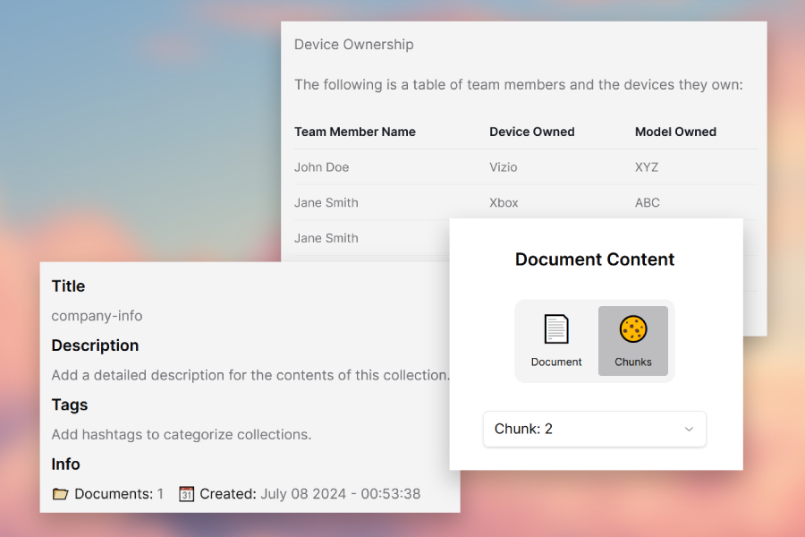

# 🍺 Obrew Studio Server - Your Personal Ai Engine

## Table of Contents

- [Features](#app-features-roadmap)
- [How to Use](assets/how-to-use.md)
- [Getting Started](assets/getting-started.md)
- [API Documentation](assets/api-docs.md)
- [Build Steps](assets/build-steps.md)
- [Bundling & Packaging](assets/bundling-packaging.md)
- [Deploy & Release](assets/deploy-release.md)
- [Development](assets/development.md)

## Introduction

The goal of this project is to be an all-in-one solution for running local Ai that is easy to install, setup and use. It is a native app that runs a server which handles all basic building blocks of building with Ai: inference, vector memory, model file manager, agent builder, GUI.

## How It Works

This backend is a Python server built with FastAPI. A WebUI is provided called [Obrew Studio WebUI](https://studio.openbrewai.com/) to access this server. You can also access it programmatically via the [API](assets/api-docs.md).

Launch the desktop app locally, then navigate your browser to any web app that supports this project's api and start using ai locally with your own private data for free:

## App Features Roadmap

- ✅ Run locally
- ✅ Desktop installers
- ✅ Save chat history
- ✅ CPU & GPU support
- ✅ Windows OS installer
- ❌ MacOS/Linux installer
- ❌ Docker config for cloud/server deployment
- ❌ Production ready: This project is currently under active development, there may be bugs

## Ai Features Roadmap

- ✅ Inference: Run open-source LLM models locally
- ✅ Embeddings: Create vector embeddings from a file/website/media to augment memory
- ✅ Knowledge Base: Search a vector database with Llama Index to retrieve information
- ✅ Agents: Customized LLM, can choose or specify tool use
- ❌ Workflows: Composable automation of tasks, teams of agents, parallel processing, conditional routing
- ❌ Monitors: Source citations, observability, logging, time-travel, transparency
- ❌ Support multi-modal: vision, text, audio, 3d, and beyond
- ❌ Support multi-device memory sharing (i.e. cluster of macs running single large model)
- ❌ Support voice-to-text and text-to-speech
- ❌ Auto Agents: Self-prompting, autonomous agent given tools and access to a sandboxed OS env

## Supported Model Providers

This is a local first project. The ultimate goal is to support many providers via one API.

- ✅ [Open-Source](https://huggingface.co)
- ❌ [Google Gemini](https://gemini.google.com)
- ❌ [OpenAI](https://openai.com/chatgpt)
- ❌ [Anthropic](https://www.anthropic.com)
- ❌ [Mistral AI](https://mistral.ai)
- ❌ [Groq](https://groq.com)

## Learn More

- Server: [FastAPI](https://fastapi.tiangolo.com/) - learn about FastAPI features and API.
- Inference: [llama-cpp-python](https://github.com/abetlen/llama-cpp-python) for Ai inference.
- Memory: [Llama-Index](https://github.com/run-llama/llama_index) for data retrieval and [ChromaDB](https://github.com/chroma-core/chroma) for vector database.
- WebUI: [Next.js](https://nextjs.org/) for front-end UI and [Pywebview](https://github.com/r0x0r/pywebview) for displaying the webview.
